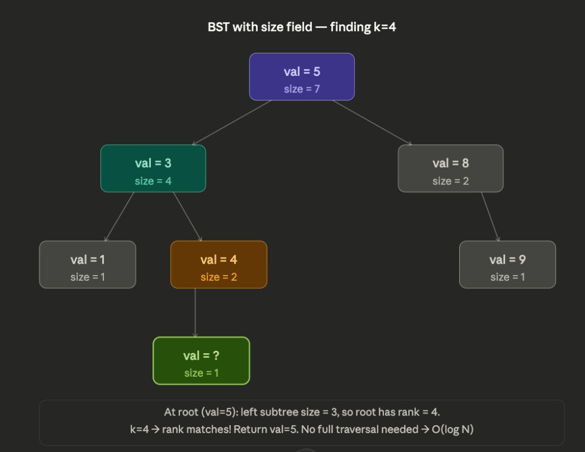

# 230. Kth Smallest Element in a BST (二叉搜索树中第 K 小的元素)

**Difficulty:** Medium

## Problem

Given the `root` of a binary search tree, and an integer `k`, return *the* `kth` *smallest value (**1-indexed**) of all the values of the nodes in the tree*.

---

## Solution

```python
# Definition for a binary tree node.
# class TreeNode:
#     def __init__(self, val=0, left=None, right=None):
#         self.val = val
#         self.left = left
#         self.right = right
class Solution:
    def __init__(self):
        self.res = None
        self.count = 0

    def kthSmallest(self, root: Optional[TreeNode], k: int) -> int:
        self.traverse(root, k)
        return self.res

    def traverse(self, root, k):
        if root is None:
            return
        self.traverse(root.left, k)
        self.count += 1
        if self.count == k:
            self.res = root.val
            return  # early stoppage
        self.traverse(root.right, k)
```

### 要点

1. **中序遍历 + BST = 有序序列**  
   本题用**中序遍历**（左 → 根 → 右），结合二叉搜索树「左 < 根 < 右」的性质，遍历顺序就是**升序**。数到第 `k` 个就是第 k 小的元素。

2. **早停（early return）**  
   找到第 `k` 个后直接 `return`，不再继续遍历右子树，避免多余递归，比「先整棵树中序再取第 k 个」更优。

3. **优于 labuladong 写法**  
   用实例变量 `res`、`count` 配合中序 + 早停，逻辑清晰、代码短，且不浪费遍历。

---

## Complexity

**O(N) 做法（上面中序 + 早停）**  
会访问到第 k 个为止，最坏仍可能接近整棵树，且本质是「按顺序数到第 k 个」。

**O(log N) 做法**  
若每个节点都知道**其左子树有多少个节点**，就能立刻知道「当前节点在自己子树里的排名」：

- **核心关系：当前节点的排名 = 左子树节点数 + 1**

这样在每个节点上都可以做一次二分类决策，无需按 1、2、3… 顺序数过去。



**三种情况：**

| 条件 | 动作 |
|------|------|
| `left.size + 1 == k` | 当前节点就是第 k 小，直接返回 |
| `k < left.size + 1` | 第 k 小在左子树，往左递归，`k` 不变 |
| `k > left.size + 1` | 第 k 小在右子树，往右递归，`k` 改为 `k - left.size - 1`（跳过左边这 `rank` 个） |

上图中找 `k=4`：根节点 (val=5) 的左子树大小为 3，所以根的排名 = 4，与 k 相等，直接返回 5，无需再访问右子树或继续遍历。

**为什么是 O(log N)**  
每一步都能排除掉大约一半的节点，和二分查找一样。而中序遍历必须按 1、2、3… 顺序访问到第 k 个。

**代价**  
在 insert/delete 时要维护每个节点的 `size`（回溯时更新）。每个节点多一个整数，写几行维护代码即可；若树经常改、又要频繁查 kthSmallest，这个代价通常值得。

### 带 size 的 BST 实现（O(log N) 查第 k 小）

```python
class TreeNode:
    def __init__(self, val=0):
        self.val = val
        self.size = 1      # counts this node + all descendants
        self.left = None
        self.right = None


class BST:
    def __init__(self):
        self.root = None

    # ── helpers ──────────────────────────────────────────
    def _size(self, node):
        return node.size if node else 0

    def _update_size(self, node):
        if node:
            node.size = 1 + self._size(node.left) + self._size(node.right)

    # ── insert ───────────────────────────────────────────
    def insert(self, val):
        self.root = self._insert(self.root, val)

    def _insert(self, node, val):
        if node is None:
            return TreeNode(val)
        if val < node.val:
            node.left = self._insert(node.left, val)
        elif val > node.val:
            node.right = self._insert(node.right, val)
        self._update_size(node)   # update on the way back up
        return node

    # ── kthSmallest — O(log N) ───────────────────────────
    def kthSmallest(self, k):
        return self._kth(self.root, k)

    def _kth(self, node, k):
        if node is None:
            return -1

        left_size = self._size(node.left)
        rank = left_size + 1        # this node's rank in its subtree

        if k == rank:
            return node.val
        elif k < rank:
            return self._kth(node.left, k)
        else:
            return self._kth(node.right, k - rank)  # shrink k
```

`_kth` 里的三种分支对应前面的逻辑：

- `rank = left.size + 1`
- `k == rank` → 找到了，返回 `node.val`
- `k < rank` → 往左走，`k` 不变
- `k > rank` → 往右走，`k` 减去 `rank`（跳过左侧这 rank 个节点）
