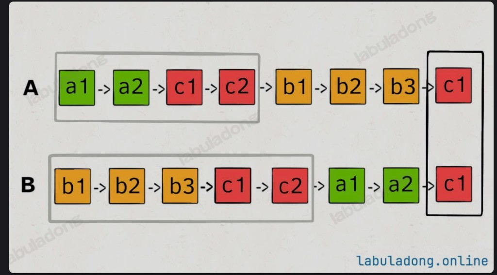

# 1650. Lowest Common Ancestor of a Binary Tree III (带 parent 指针的 LCA)

**Difficulty:** Medium

## Problem

Given two nodes `p` and `q` in a binary tree with **parent pointers**, return their lowest common ancestor (LCA). You only have access to the two nodes, not the root.

**本质：** 单链表「两指针相遇」的技巧。从 p、q 各自沿 parent 往上走，走到头就换到对方起点再走，两指针一定会在 LCA 相遇。

---

## Solution

```python
# Definition for a Node.
class Node:
    def __init__(self, val):
        self.val = val
        self.left = None
        self.right = None
        self.parent = None

class Solution:
    def lowestCommonAncestor(self, p: 'Node', q: 'Node') -> 'Node':
        a, b = p, q
        while a != b:
            if a:
                a = a.parent
            else:
                a = q
            if b:
                b = b.parent
            else:
                b = p
        return a
```

---

## 思路（看图）

两个指针 `a`、`b`：`a` 从 p 出发沿 parent 往上走，`b` 从 q 出发沿 parent 往上走。谁先走到头（`None`），谁就「换道」从对方起点再往上走。

- **Path A**：`a` 先走完「p → 根」这一段，再换到 q，走「q → LCA」。  
- **Path B**：`b` 先走完「q → 根」，再换到 p，走「p → LCA」。

两指针走过的总长度一样（都是「p 到 LCA」+「q 到 LCA」+ 公共祖先到根），所以一定会在**第一个公共节点**相遇，那就是 LCA。


